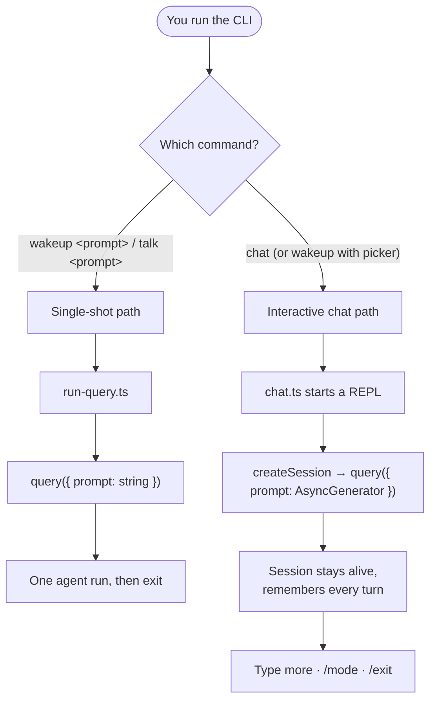
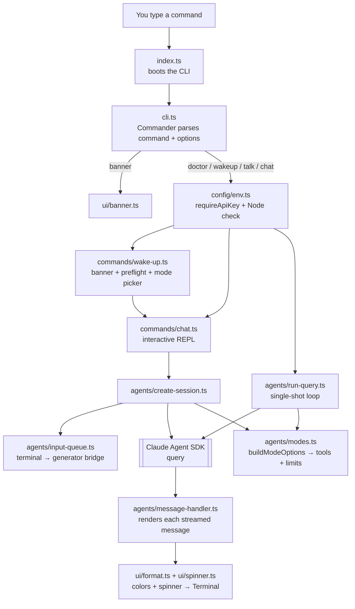
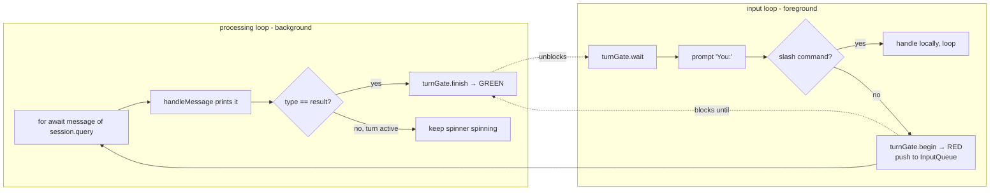
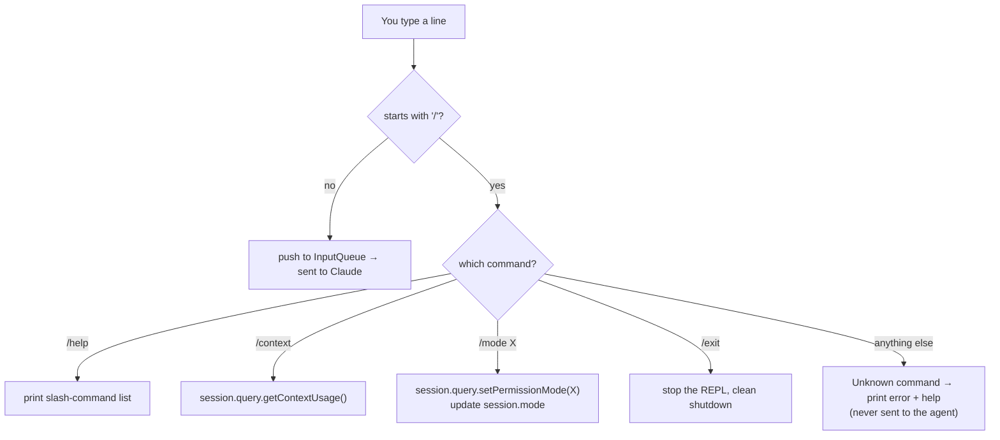
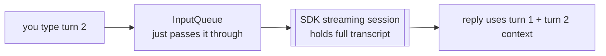
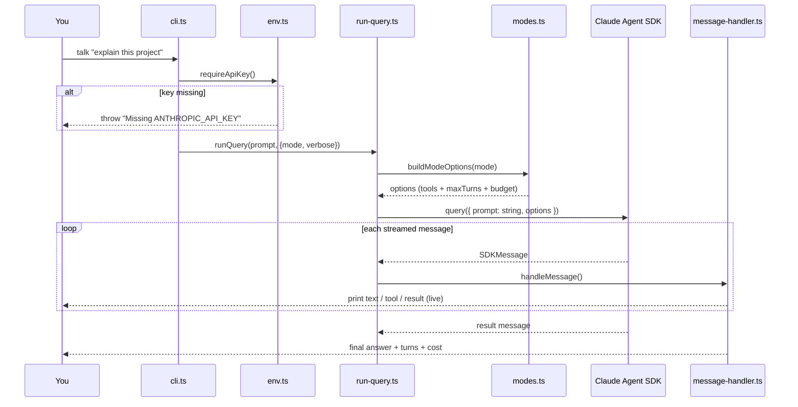
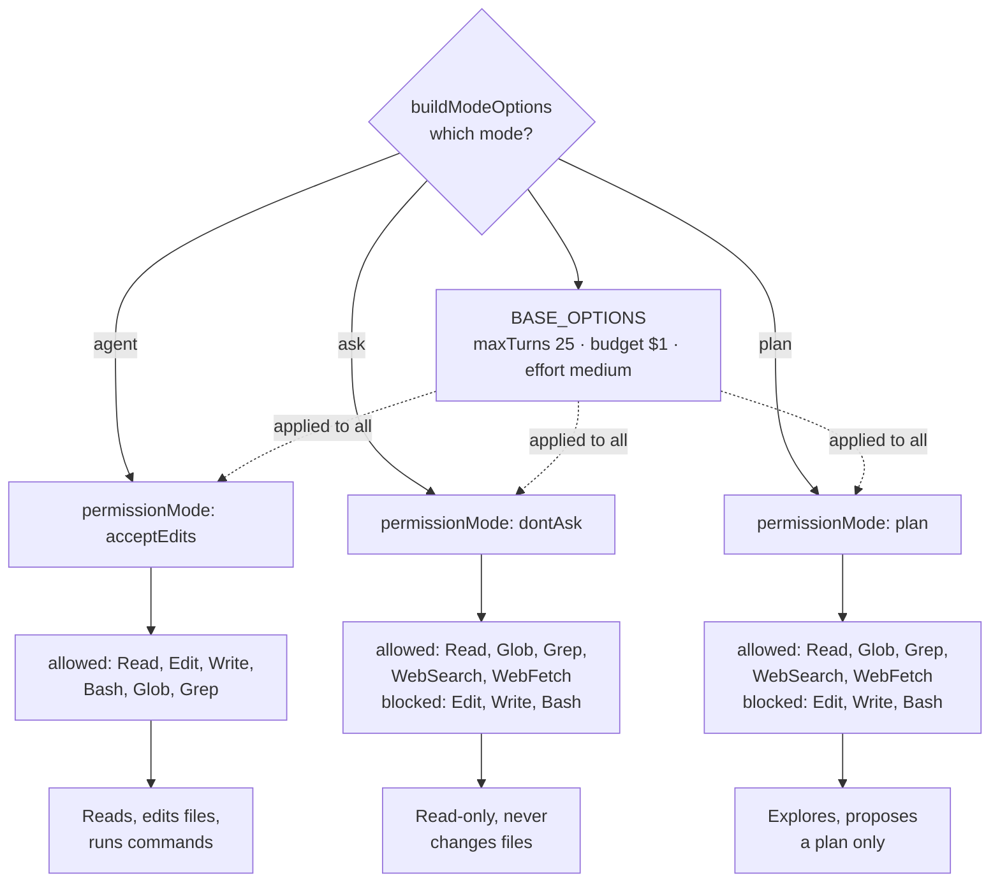
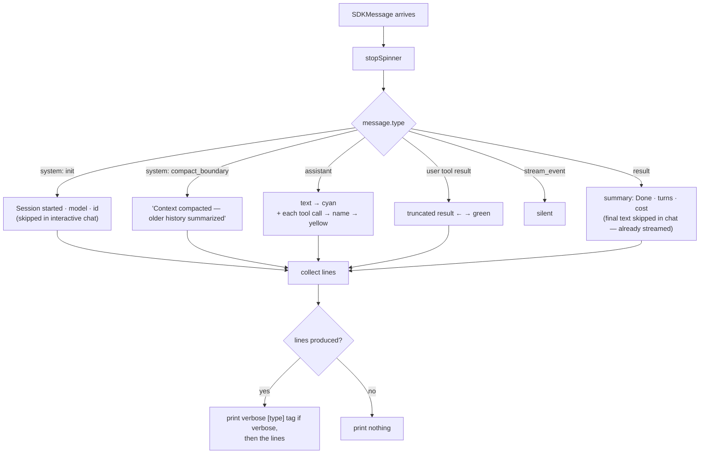
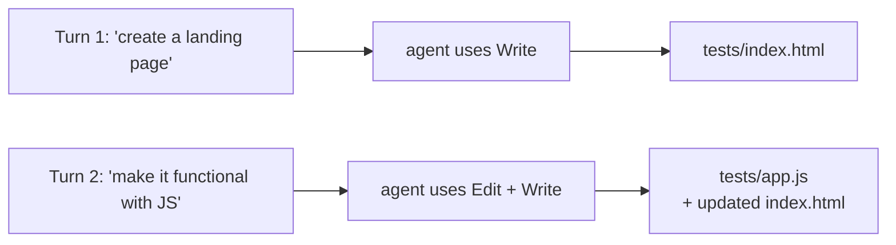

# CodeBrew

> **CodeBrew — brew your code with AI.** A command-line assistant that lets you talk to Claude AI right from your terminal — ask questions, explore a codebase, or hold a full back-and-forth conversation where Claude can read, write, and run commands on your behalf.

---

## In Plain English (for everyone, tech or not)

Imagine having a smart assistant that lives inside your computer's terminal (the black text window developers use). You type a request in normal language — like *"summarize what this project does"* or *"build me a to-do list webpage"* — and the assistant does the work for you.

This project is that assistant. It connects to **Claude**, an AI model made by Anthropic, and gives it a safe, controlled way to help with real tasks:

- **Answer questions** about your files and projects.
- **Explore** a folder and explain how things work.
- **Make changes** — create files, edit code, and run commands — but only when you allow it.
- **Hold a conversation** — a live chat session that remembers everything said so far, so you can build on previous answers turn after turn.

The key idea is **safety through modes**. You decide how much freedom the assistant gets:

| Mode | What it means in everyday terms |
|------|--------------------------------|
| **Ask** | "Just look and tell me." It can read and answer, but never changes anything. |
| **Plan** | "Think it through and give me a plan." It proposes what it *would* do, without touching files. |
| **Agent** | "Go ahead and do it." It can read, write, and run commands to finish the task. |

Think of it like hiring a helper: sometimes you just want advice (Ask), sometimes you want a proposal before spending money (Plan), and sometimes you trust them to get the job done (Agent). And the best part — you can switch that trust level mid-conversation with a single `/mode` command.

> **Want to see what it can actually build?** The [`tests/`](#the-tests-folder-real-agent-output) folder contains real files this agent generated on its own — a full landing page with working JavaScript, plus a short markdown file. See the [Tests Folder](#the-tests-folder-real-agent-output) section.

---

## Table of Contents

- [What This Project Is](#what-this-project-is)
- [Key Features](#key-features)
- [Tech Stack](#tech-stack)
- [Two Ways to Run: Single-Shot vs. Interactive Chat](#two-ways-to-run-single-shot-vs-interactive-chat)
- [Architecture Overview](#architecture-overview)
- [The Interactive Chat Engine (Deep Dive)](#the-interactive-chat-engine-deep-dive)
- [How Conversation Memory Works](#how-conversation-memory-works)
- [End-to-End Flow: Single-Shot Command](#end-to-end-flow-single-shot-command)
- [Command Reference](#command-reference)
- [The Three Modes Explained](#the-three-modes-explained)
- [Message Handling Flow](#message-handling-flow)
- [File-by-File Breakdown](#file-by-file-breakdown)
- [Project Structure](#project-structure)
- [The Tests Folder (Real Agent Output)](#the-tests-folder-real-agent-output)
- [Getting Started](#getting-started)
- [Configuration](#configuration)
- [Roadmap / Not Yet Implemented](#roadmap--not-yet-implemented)
- [License](#license)

---

## What This Project Is

**CodeBrew** is a TypeScript command-line tool built on top of the [Anthropic Claude Agent SDK](https://www.npmjs.com/package/@anthropic-ai/claude-agent-sdk). It wraps the SDK's agent loop in a friendly, colorful terminal interface and layers a permission system on top so you control exactly what the AI is allowed to do.

It supports two interaction styles:

- **Single-shot** (`wakeup <prompt>`, `talk <prompt>`) — one prompt in, one agent run, done.
- **Interactive chat** (`chat`) — a persistent streaming session that remembers the whole conversation and lets you switch modes on the fly.

It is designed both as a **learning project** for the Claude Agent SDK and as a foundation for a production-ready CLI assistant.

---

## Key Features

- **Interactive chat session** — a live REPL with conversation memory, powered by the SDK's streaming-input mode.
- **Three permission modes** — `agent`, `ask`, and `plan` — that map to different tool access levels.
- **Mid-session mode switching** — `/mode agent|ask|plan` changes permissions live, without restarting.
- **Slash commands** — `/help`, `/context`, `/mode`, `/exit`; unknown slash commands are caught locally and never leak to the agent.
- **Streaming responses** — assistant text, tool calls, and results print live as they arrive.
- **Tool visibility** — you see every tool Claude invokes (`Read`, `Edit`, `Write`, `Bash`, `Glob`, `Grep`, `WebSearch`, `WebFetch`).
- **Budget & turn guardrails** — each session is capped at 25 turns and $1.00 USD by default.
- **Environment doctor** — a `doctor` command checks your Node version and API key before you start.
- **Guided startup** — `wakeup` shows a banner, runs a preflight check, and lets you pick a mode before dropping you into chat.
- **Polished terminal UI** — ASCII banner, colored output, spinners, and clean turn-by-turn rendering.
- **Cost reporting** — every turn prints how many turns it took and the running total cost in USD.

---

## Tech Stack

| Layer | Technology |
|-------|-----------|
| Language | TypeScript (ES2022, NodeNext modules) |
| Runtime | Node.js 18+ |
| AI SDK | `@anthropic-ai/claude-agent-sdk` |
| CLI framework | `commander` |
| Interactive prompts | `@inquirer/prompts` |
| Terminal UI | `chalk`, `boxen`, `figlet`, `ora` |
| Process execution | `execa` |
| Config | `dotenv` |
| Dev tooling | `tsx`, `typescript` |

---

## Two Ways to Run: Single-Shot vs. Interactive Chat

The whole architecture branches into two paths depending on how you want to talk to Claude. Understanding this split makes everything else click.



| | Single-shot (`wakeup` / `talk`) | Interactive chat (`chat`) |
|---|---|---|
| SDK input | a **string** | an **AsyncGenerator** of messages |
| SDK mode | single-message mode | streaming-input mode |
| Memory | none — each run is isolated | full — remembers the whole session |
| Mode switching | fixed for the run | live via `/mode` |
| Lifetime | one run, then exits | until you `/exit` |
| Entry file | `agents/run-query.ts` | `commands/chat.ts` |

The single difference at the SDK level is what you pass as `prompt`: a plain string gives you one isolated run; an `AsyncGenerator` unlocks a stateful, streaming session. Everything the chat engine does is built around feeding that generator.

---

## Architecture Overview

The app has a few clear responsibilities: parse the command, guard the environment, decide the mode, run the agent, and render output. The newer files (`commands/`, `input-queue.ts`, `create-session.ts`) add the interactive-chat layer on top of the original single-shot core.



**How to read this:** `index.ts` boots the program; `cli.ts` maps each command to its action. `banner` is standalone; the AI commands pass through `env.ts` (the guard). From there, `chat`/`wakeup` build a streaming session (`create-session.ts` + `input-queue.ts`), while `talk` uses the single-shot `run-query.ts`. Both feed the same SDK and share `modes.ts` (permissions) and `message-handler.ts` (rendering).

---

## The Interactive Chat Engine (Deep Dive)

This is the heart of the project. A chat loop is tricky because **two things must run at the same time**: reading Claude's streamed replies, and reading your keyboard input. If you did them one after another, you'd block on one and miss the other.

The solution uses three cooperating pieces:

1. **`InputQueue`** (`input-queue.ts`) — a bridge that turns imperative terminal input ("user typed a line") into the pull-based `AsyncGenerator` the SDK wants.
2. **`createSession`** (`create-session.ts`) — starts the streaming SDK session using that queue's generator, and hands back the controls.
3. **The chat REPL + turn gate** (`chat.ts`) — runs two loops in parallel and coordinates them with a small "traffic light" called the turn gate.

### The two loops and the turn gate



- **`turnGate.begin()`** = red light. A turn is now in flight; the input loop must wait.
- **`turnGate.finish()`** = green light. The turn produced its `result`; it's your turn to type again.
- **`turnGate.isActive()`** tells the background loop whether a real turn is running — used to decide when to keep the spinner alive and when to ignore stray control messages.

### A full turn, step by step

```mermaid
sequenceDiagram
    participant You
    participant Loop as input loop (chat.ts)
    participant Gate as turnGate
    participant Q as InputQueue
    participant SDK as SDK session (Query)
    participant BG as processing loop
    participant H as message-handler.ts

    You->>Loop: types "create a landing page"
    Loop->>Gate: begin() (RED)
    Loop->>Q: push(text)
    Q->>SDK: generator yields the message
    loop streamed messages
        SDK-->>BG: assistant text / tool_use / tool result
        BG->>H: handleMessage(interactive: true)
        H-->>You: prints live (text, → tool, ← result)
    end
    SDK-->>BG: result message
    BG->>Gate: finish() (GREEN)
    Gate-->>Loop: wait() resolves
    Loop->>You: shows "You:" again
```

### Slash commands are intercepted before the SDK

When you type a line, the REPL first checks whether it's a slash command. If so, it's handled locally and **never** pushed to the queue — so a typo like `/ask` can't accidentally trigger one of Claude Code's own built-in commands.



### Clean shutdown

Typing `/exit` breaks the input loop, then teardown runs in order so nothing hangs:

1. `session.inputQueue.close()` — ends the generator (yields `null`), telling the SDK no more input is coming.
2. `session.query.close()` — closes the SDK session.
3. `await processing` — waits for the background loop to finish draining.
4. Prints `Session ended.`

---

## How Conversation Memory Works

A common question: *where does the "memory" live, and which method are we calling to store it?*

The answer is that **there is no memory method to call.** Memory is a side effect of *how* `query()` is invoked:

- Pass a **string** → single-message mode → no memory.
- Pass an **`AsyncGenerator`** (what `createSession` does) → streaming-input mode → the SDK keeps one session alive and accumulates every turn.



Key points to keep in mind:

- **The SDK holds the history, not our code.** `InputQueue` is a pipe, not a store — once a message is yielded, it's gone from the queue.
- **Memory lasts only while the session is open.** On `/exit`, the session ends and the in-memory history is discarded. (Persisting across restarts would use the SDK's `resume` / session-id features — not implemented here.)
- **Context isn't infinite.** As the conversation grows, the SDK automatically summarizes older turns and emits a `compact_boundary` message. `message-handler.ts` renders this as *"Context compacted — older history summarized."*
- **The `Query` handle exposes live controls** — `setPermissionMode()` (used by `/mode`), plus `interrupt()`, `setModel()`, and others — all only available in streaming-input mode.

---

## End-to-End Flow: Single-Shot Command

For the simpler `talk` / `wakeup <prompt>`-style path, here's the full sequence:



---

## Command Reference

All commands run through the `codebrew` program defined in `cli.ts`.

| Command | Description | Options |
|---------|-------------|---------|
| `chat` | Start an **interactive streaming chat session** with memory. | `-m, --mode <agent\|ask\|plan>` (default `agent`), `-v, --verbose` |
| `wakeup` | Banner + environment preflight + interactive mode picker, then drops into `chat`. | — |
| `talk <prompt>` | Single-shot prompt (runs in the default `agent` mode). | `-v, --verbose` |
| `doctor` | Verifies Node.js 18+ and that `ANTHROPIC_API_KEY` is set. | — |
| `banner` | Shows the ASCII welcome banner. | — |
| `hello` | Prints `Hello, World!` — a sanity check. | — |

Running the program with no command prints the help screen.

**Examples:**

```bash
# Guided start: banner, preflight, pick a mode, then chat
npm run dev -- wakeup

# Jump straight into an interactive chat in agent mode, verbose
npm run dev -- chat --mode agent --verbose

# Interactive chat, read-only
npm run dev -- chat --mode ask

# One-off single-shot prompt
npm run dev -- talk "what does src/agents do?"

# Environment check
npm run dev -- doctor
```

> **Important:** the `--` after the npm script is required. It tells npm to forward the flags (like `--mode`) to the CLI instead of consuming them itself. Without it you'll see `Unknown cli config "--mode"` and argument-parsing errors.

### Slash commands (inside a chat session)

| Command | What it does |
|---------|-------------|
| `/mode agent\|ask\|plan` | Switch permission mode mid-session (live, no restart). |
| `/help` | Show the slash-command list. |
| `/context` | Show context-window usage for the current session. |
| `/exit` | End the chat session cleanly. |

---

## The Three Modes Explained

Modes are defined in `src/agents/modes.ts`. Each mode maps to an SDK `PermissionMode` and a specific set of allowed/disallowed tools. The same mapping is used whether you're in single-shot or chat mode.



**Shared guardrails** (applied to every mode via `BASE_OPTIONS`):

- `maxTurns: 25` — stops runaway loops.
- `maxBudgetUsd: 1.0` — caps spend per session.
- `effort: "medium"` — balances speed and depth.
- `settingSources: ["project"]` — loads project-level settings.

| Mode | Permission Mode | Can Edit/Run? | Best For |
|------|----------------|---------------|----------|
| `agent` | `acceptEdits` | Yes | Getting work done |
| `ask` | `dontAsk` | No | Quick answers & exploration |
| `plan` | `plan` | No | Reviewing an approach before acting |

In a chat session, `/mode` calls `cliModeToPermissionMode()` and then `session.query.setPermissionMode()` to apply the new permission mode to the live session instantly.

---

## Message Handling Flow

As Claude works, the SDK streams different message types. `message-handler.ts` decides how each one is displayed. It collects output lines first, then prints — so during long, tool-heavy turns you don't get a pile-up of empty `[system]` / `[assistant]` verbose tags.



**Handler options that shape rendering:**

- `verbose` — prints a dim `[type]` tag before any message that produced output.
- `manageSpinner` — when `true` (single-shot default) the handler drives the spinner; the chat REPL sets it `false` to own the spinner via the turn gate.
- `interactive` — chat mode; skips the per-turn "Session started" line and skips re-printing the final result text (it already streamed live), leaving just the `Done · turns · cost` summary.

Color coding lives in `ui/format.ts` (assistant cyan, tools yellow, results green, errors red, mode magenta); the spinner lifecycle is in `ui/spinner.ts`.

---

## File-by-File Breakdown

### Entry & CLI

| File | Intention |
|------|-----------|
| `src/index.ts` | Boots the app: builds the Commander program and parses `process.argv`. |
| `src/cli.ts` | Defines every command (`chat`, `wakeup`, `talk`, `doctor`, `banner`, `hello`), their options, and wires each to its action. Also validates `--mode` via `parseMode()`. |

### Commands

| File | Intention |
|------|-----------|
| `src/commands/chat.ts` | The **interactive REPL**. Runs the dual-loop + turn-gate engine, handles slash commands locally, drives the spinner, and manages clean shutdown. |
| `src/commands/wake-up.ts` | The **guided entry point**. Prints the banner, runs the environment preflight (`doctor`), shows mode panels, asks you to pick a mode, then calls `startChat()`. |

### Agents (the core)

| File | Intention |
|------|-----------|
| `src/agents/input-queue.ts` | Bridges imperative terminal input to the SDK's pull-based `AsyncGenerator`. Buffers early input in `pending[]`, or resolves a waiting SDK pull immediately. `close()` yields `null` to end the stream. |
| `src/agents/create-session.ts` | Starts a streaming-input SDK session by passing `inputQueue.generator()` as the prompt. Returns `{ query, inputQueue, mode }` — send input, receive output + controls, track state. |
| `src/agents/run-query.ts` | The **single-shot** path. Passes a plain string prompt to `query()` and streams the result through `handleMessage`. |
| `src/agents/modes.ts` | Maps each `CliMode` to a `PermissionMode` and an allowed/disallowed tool set, merged with shared `BASE_OPTIONS` (turns, budget, effort). |
| `src/agents/message-handler.ts` | Renders each streamed `SDKMessage` (system, assistant, tool use, tool result, result), with `verbose` / `manageSpinner` / `interactive` toggles. |
| `src/agents/permission.ts` | `promptBeforeToolUse` — an interactive "allow this tool?" confirmation. Implemented but not yet wired into `query()`. |

### Config & UI

| File | Intention |
|------|-----------|
| `src/config/env.ts` | `requireApiKey()` and `checkEnvironment()` (Node 18+ and API-key checks). |
| `src/config/constants.ts` | `CLI_MODES`, `MODE_DESCRIPTIONS`, and the `SLASH_COMMANDS` list. |
| `src/ui/banner.ts` | ASCII `figlet` banner inside a `boxen` panel. |
| `src/ui/format.ts` | `chalk` color helpers (`fmt.*`) and a `truncate()` utility. |
| `src/ui/spinner.ts` | Single-spinner lifecycle (`start` / `update` / `stop`) via `ora`. |

---

## Project Structure

```
codebrew/
├── src/
│   ├── index.ts                  # Entry point — builds and parses the CLI
│   ├── cli.ts                    # Commander program & command definitions
│   ├── commands/
│   │   ├── chat.ts               # Interactive REPL (dual-loop + turn gate)
│   │   └── wake-up.ts            # Guided start: banner + preflight + mode picker
│   ├── agents/
│   │   ├── input-queue.ts        # Terminal input → SDK AsyncGenerator bridge
│   │   ├── create-session.ts     # Starts a streaming-input session
│   │   ├── run-query.ts          # Single-shot query loop
│   │   ├── modes.ts              # Mode → permission/tool mapping
│   │   ├── message-handler.ts    # Renders streamed SDK messages
│   │   └── permission.ts         # Interactive tool-approval prompt (not yet wired in)
│   ├── config/
│   │   ├── env.ts                # API key + Node version checks
│   │   └── constants.ts          # Mode descriptions & slash-command list
│   └── ui/
│       ├── banner.ts             # ASCII welcome banner
│       ├── format.ts             # Chalk color helpers + truncate
│       └── spinner.ts            # Ora spinner lifecycle
├── sample/                       # Starter static files (todo app HTML/CSS)
│   ├── index.html
│   └── style.css
├── tests/                        # ← Output generated BY the agent (see below)
│   ├── index.html
│   ├── app.js
│   └── sample.md
├── package.json
├── tsconfig.json
└── README.md
```

---

## The Tests Folder (Real Agent Output)

The `tests/` folder is **not** a test suite. It holds real artifacts this agent produced while running in `agent` mode during interactive chat sessions — a live demonstration of what the tool can build end-to-end.

| File | How it was produced |
|------|---------------------|
| `tests/index.html` | Asked the agent to *"create an index.html with a clean and beautiful landing page."* It wrote a single-file, dependency-free landing page (sticky nav, hero, feature grid, stats band, CTA, footer, dark theme). |
| `tests/app.js` | A follow-up turn: *"make that landing page functional using JS."* The agent added theme toggle, mobile menu, smooth scroll, scroll progress bar, reveal animations, animated counters, form validation with toasts, back-to-top, and `prefers-reduced-motion` handling — then wired it into the HTML. |
| `tests/sample.md` | A short markdown file the agent wrote on request. |



Because the interactive session remembers context, Turn 2 knew exactly which file Turn 1 had created — no need to re-explain. Open `tests/index.html` directly in a browser to see the result.

---

## Getting Started

### Prerequisites

- **Node.js 18 or higher**
- An **Anthropic API key** ([get one here](https://console.anthropic.com/))

### 1. Install dependencies

```bash
npm install
```

### 2. Set your API key

Create a `.env` file in the project root:

```env
ANTHROPIC_API_KEY=your_api_key_here
```

> `.env` is git-ignored, so your key stays local.

### 3. Verify your setup

```bash
npm run dev -- doctor
```

You should see:

```
✅ Node.js is >= 18
✅ ANTHROPIC_API_KEY is set
```

### 4. Start chatting

```bash
# Guided start with a mode picker
npm run dev -- wakeup

# Or jump straight into a chat
npm run dev -- chat --mode agent
```

### Available npm scripts

| Script | Command | Purpose |
|--------|---------|---------|
| `dev` | `tsx src/index.ts` | Run directly from TypeScript source |
| `build` | `tsc` | Compile TypeScript to `dist/` |
| `start` | `node dist/index.js` | Run the compiled build |

---

## Configuration

| Setting | Where | Default | Notes |
|---------|-------|---------|-------|
| `ANTHROPIC_API_KEY` | `.env` | — | Required for `chat`, `wakeup`, and `talk` |
| `maxTurns` | `modes.ts` | `25` | Max agent iterations per session |
| `maxBudgetUsd` | `modes.ts` | `1.0` | Spend cap per session |
| `effort` | `modes.ts` | `"medium"` | Reasoning effort level |
| `settingSources` | `modes.ts` | `["project"]` | Where the SDK loads settings from |

---

## Roadmap / Not Yet Implemented

Recently completed:

- ✅ **Interactive chat session / REPL** (`commands/chat.ts`) with conversation memory.
- ✅ **Mid-session mode switching** via `/mode`.
- ✅ **Slash commands** (`/help`, `/context`, `/mode`, `/exit`) with local handling of unknown commands.
- ✅ **Guided `wakeup`** entry with mode picker.

Still open:

- **Interactive tool approval.** `agents/permission.ts` implements a `promptBeforeToolUse` confirmation prompt, but it is not yet passed into the SDK `query()` call. Wiring it in would enable an "ask before every tool" experience.
- **`/context` robustness.** `/context` calls `session.query.getContextUsage()`; if a given SDK/session build doesn't expose it, the command degrades to an error message (guarded by try/catch). Worth confirming against your SDK version.
- **Persistent history across restarts.** Sessions currently forget everything on `/exit`. The SDK's `resume` / session-id features could add "resume my last chat."
- **The `sample/` app references `app.js`** in its HTML, but that script isn't present — it's a placeholder target. (The finished, functional example lives in `tests/` instead.)
- **Automated tests.** The `test` npm script is still a placeholder (`exit 1`). Note that `tests/` currently holds agent-generated demo output, not a test suite.

Contributions and experiments are welcome as these features come together.

---

## License

ISC. See `package.json` for details.
